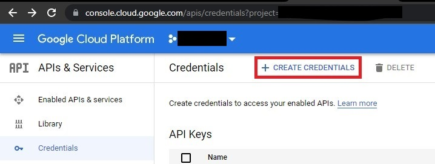
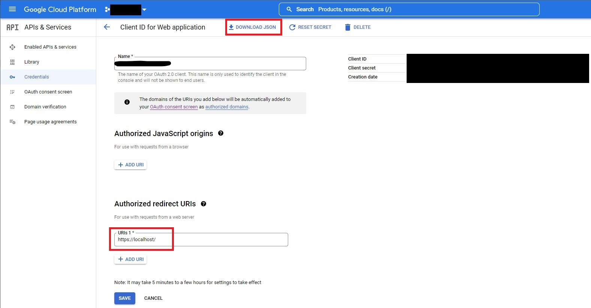

# Youtube AutoManager
Adds videos to your YouTube playlists automatically based on rules
- Create a Project in the [Google Cloud Platform](https://console.cloud.google.com/projectcreate)
- Click Create Credentials

- Select OAuth Client ID
- Select Application Type: Web Application
- Enter any Name
- Add Authorized redirect URI: https://localhost/
- Download Credentials JSON file

- Create config file @ ~/youtube_automanager/youtube_automanager.yaml using the template file youtube_automanager.yaml.example
- Fill in the config file with your prefered video management rules
- Install the dependencies using "pip install -r requirements.txt"
- Run the program using "python -m youtube_automanager.runners.automanage"

The script:
- Gets all your subscribed channels
- Gets last 20 videos from each channel
- Checks if each video is already in the playlist
- If not, adds the video to the playlist based on rule it meets

Do not forget to run the Docker image with `--init` argument for SIGTERM to correctly forward to child processes.
